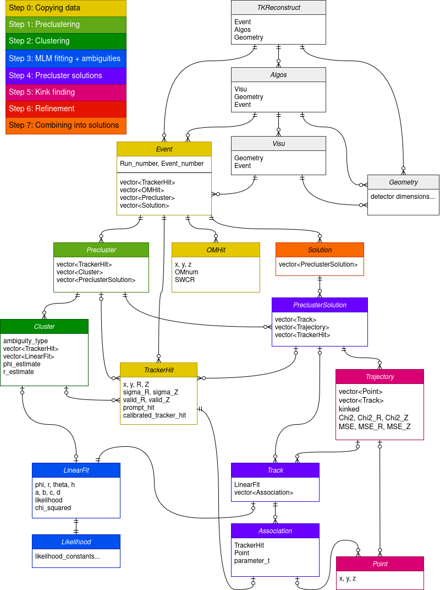

# Cimrman Reconstruction Module

*"Algorithm so intuitive, you would think Jára Cimrman designed it."*

Cimrman is a track reconstruction module for SuperNEMO. It reconstructs charged particle trajectories using a combination of Legendre transform and maximum likelihood methods. Named in tribute to the great Czech thinker Jára Cimrman. The module takes **CD bank as an input**, reconstructs the trajectories within its own internal structure and **outputs both TCD and TTD data banks**, meaning it is responsible for clustering of tracker hits and for trajectory reconstruction at the same time. Currently it is able to produce **line and polyline trajectories**. It also detects ambiguous parts of tracker data and **provides all alternative possible solutions** (*tracker_trajectory_solution* and *tracker_clustering_solution*) in such cases. 

To obtain the final **PTD bank** you then need to apply **Charged Particle Tracking** module that extrapolates the verteces and creates the PTD bank.

You can find detailed description of the algorithm, its structure and the derivation of all methods in my [Master thesis](https://dspace.cvut.cz/handle/10467/123238). Specifically, Chapter 5 describes the software structure of the algorithm.

## Module installation

In the future the module will be integrated in Falaise by default, but at the moment the module has to be installed independantly. For this reason, I temporarily provided the installation script install.sh

```
chmod 755 install.sh
./install.sh
```

## Module example usage

```
cd testing/test2/
flreconstruct -i test_SD.brio -p reco.conf -o test_TTD.brio
```

## Module configuration

See the provided example configuration file *testing/test2/pipeline.conf*, which contains the default setting. 

1. **General configuration section:**
	* *visualization_2D*: Creating and saving a png image for each solution of each event.
	* *visualization_3D*: Creating and saving a 3D object root file for each solution of each event.

     	**Warning:** intended for debugging purposes only, do not use on large datasets unless you want to generate enormous amount of files.
	* *electron_mode*: "polyline" mode enables polyline trajectory, "line" disables polylines
 	* *reconstruct_alphas*: turns on alpha particle tracking (or electrons without a reference OM hit)   
	* *use_provided_preclustering*: use (pre)clustering from existing TCD bank if available (for example pcd2cd output) 
	* *force_default_sigma_r*: not using the drift radii uncertainties provided by Falaise and using default value instead
	* *default_sigma_r*: universal default uncertainty for drift radii
	
2. **Electron clustering section:**
	* *save_sinograms*: saving the images of sinograms produced during Legendre transform based clustering.

     	**Warning:** intended for debugging purposes only, do not use on large datasets unless you want to generate enormous amount of files.
	* *max_distance*: the maximum distance between two groups of tracker hits to be still considered as a part of one cluster 
		distance between tracker hits i and j = distance of their anodes:
		D(i,j) := sqrt( (x<sub>j</sub> - x<sub>i</sub>)<sup>2</sup> + (y<sub>j</sub> - y<sub>i</sub>)<sup>2</sup> )
		distance between two groups of tracker hits G<sub>1</sub> and G<sub>2</sub> = minimum distance between among all possible pairs of tracker cells from the two groups)
		D(G<sub>1</sub>, G<sub>2</sub>) := min{ D(i,j) | i from G<sub>1</sub>, j from G<sub>2</sub> }
	* *hit_association_distance*: clustering first finds a rough estimate for a line fit. Then associates tracker hits to it based on this distance threshold
	* *no_iterations*: number of iterations of the itterative zooming grid search algo used to find the maximum of the sinograms
	* *resolution_phi*: number of bins used for the grid search algo. starting range for phi is (0, phi)
	* *resolution_r*: number of bins used for the grid search algo. starting range for r is optimized to be minimal for each event.
	* *max_initial_precision_r*: If the initial range for r is low enough, number of used bins in r is reduced. In that case one bin = clustering_max_initial_precision_r
	* *zoom_factor*: each iteration of the search algo zooms in with this factor to achieve better precision
	* *uncertainty*: defines the blurring of the sinograms to compensate for errors and uncertainty caused by scattering
	
3. **Alpha clustering section:**
	* *clustering_resolution_phi*: number of bins used for the alpha cluster estimation - provides angular bounds for the alpha track
	* *save_sinograms*: saving the images of sinograms produced during Legendre transform based clustering.
	* *min_possible_drift_time*: minimum allowed value of drift time  
	* *max_possible_drift_time*: maximum allowed value of drift time
	* *time_step*: size of the time step - drift radii are recalculated and the Legendre transform based track estimation is done for each time value
	* *phi_step*: size of the angular step used for the Legendre transform based track estimation
	* *max_r*: the maximum considered distance between the track and the center of the cluster
	* *resolution_r*: number of bins used to investigate the [-max_r, max_r] range
 	* *uncertainty*: defines the blurring of the sinograms to compensate for errors and uncertainty caused by scattering

4. **Polyline reconstruction section:**
	* *max_extention_distance*: trajectory can be extended by associating additional tracker hit that satisfy the "clustering_hit_association_distance". This parameter defines the maximum possible elongation of the trajectory

	a) **Finding sharp kinks** - only vertical part of segments is changed
	* *max_vertical_distance*: maximum possible vertical distance of the two segments to be connected (computed in the point of their intersection in the horizontal projection)
	* *min_tracker_hits_distance*: tracker hits on both segments must be at least this close to the candidate kink to prevent the creation of distant "stranded" fake kinks
	* *max_kink_angle*: limits the 3D kink angle for the kink finder algo
	* *min_distance_from_foil*: prevents the kink to be created close to the foil
	
	b) **Finding tiny kinks** - all parameters of segments can be slightly changed			
	* *max_trajectories_middlepoint_distance*: maximum allowed horizontal shift of the segments to be connected into a polyline
   	* *max_trajectory_endpoints_distance*: maximum allowed 3D distance for two endpoints of two trajectories to be connected into polyline
	* *max_trajectory_connection_angle*: maximum alowed 3D angle for two trajectories to be connected into one polyline trajectory

## Software design



